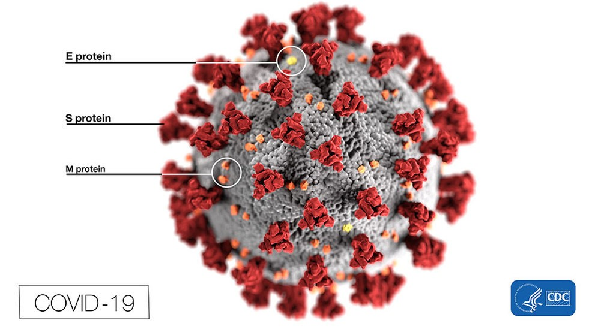

# NOVEL CORONAVIRUS v2.0

## What is COVID-19?

* Taxonomy: Coronaviridae, Betacoronavirus, Sarbecovirus;
* Genome: approximately 30 Kb positive-sense, single-stranded RNA;
* Structural biology: The viral 3C-like protease M(pro) from the ORF1a polyprotein has been modeled for drug docking experiments (PDB: 6LU7);
* Infection: Human-to-human transmission of the virus has been confirmed;
* RNA Transcript: 5' methyl cap, 3' poly-A tail;
* Transmission: Human-to-human transmission of the virus has been confirmed. Viral RNA has also been found in stool samples from infected patients.

## Symptoms

* Very Dry coughs.
* Extreme Fatigue.
* Ocular irritation
* Bone pain, dryness feeling.

## Objectives for the pandemic

* The chief objective of global health efforts against COVID-19 remains to effectively quarantine patients and screen individuals who may be infected to limit spread.

## COVID-19 main proteinase (Mpro)

* The coronavirus 3CL hydrolase (Mpro) enzyme, also known as the main protease, is essential for proteolytic maturation of the virus and regulates the activity of the viral replication complex.
* It is thought to be a promising target for discovery of small-molecule drugs that would inhibit cleavage of the viral polyprotein and prevent spread of the infection.
* Comparison of the protein sequence of the COVID-19 coronavirus 3CL hydrolase (Mpro) against the PDB archive identified 95 PDB proteins with at least 90% sequence identity.
* In order to elucidate the inhibition mechanism of SARS-CoV-2 Mpro in compounds 11a and 11b, the scientists determined the high-resolution crystal structure of complexes Mpro-11a (PDB: 6LZE) and Mpro-11b (PDB: 6M0K) at 1.5-A resolution.

## Treatment strategies against COVID-19

* Developing neutralizing antibodies to COVID-19
* Using oligonucleotides against COVID-19 RNA genome
* Repurposing currently available antiviral medications
* Passive antibody transfer from convalescent patient sera
* Blocking agents that bind to ACE2 receptor
* ACE2 immunoadhesin strategy

## Associated proteins on its surface

* Spike protein (SProt) (150 kilodaltons)
  * Binds to ACE2 in human lungs, other.
  * Proteolysis promotes virus-cell fusion.

* Hemagglutinin Esterase Protein (HE) (65 Kilodaltons)

* Membrane/Matrix Glycoprotein (Mprot) (25 Kilodaltons)
  * Most Abundant. Structural Protein.
  * Triple-spanning trans-membrane protein.
  * Short amineacid ecto-domain
  * Role in capsid self-assembly.
  * Determinant of virion morphogenesis.

* Small Envelope Protein (Eprot) (9-12 Kilodaltons)

## Intermediate surface proteins

* Nucleo-capsid Protein (Nprot) (60 kilodaltons)
  * RNA binding protein.
  * Many of its functions are unknown.
  * Remains conserved from SARS-1
  * Monocyte Migration Inhibitor Factor(MIF) decreased from SARS-1
  * Specific binding to MIF proteins
  * MIF hampers erythropoiesis  

## Non-structural proteins (Potential for drug targets)

* 3-Chymotrypsin-like protease
* Papain-line protease
* Helicase
* Mpro in compounds 11a and 11b
  * Mpro-11a (PDB: 6LZE)
  * Mpro-11b (PDB: 6M0K)
* And RNA-dependent rna polymerase.
